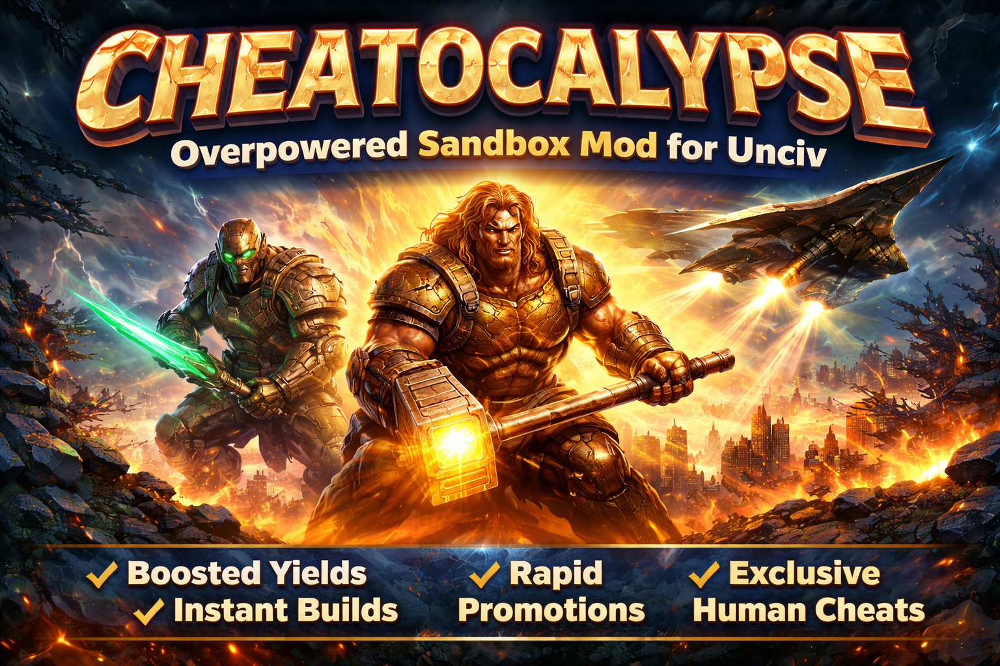

# Cheatocalypse

  

A chaos sandbox mod for [Unciv](https://github.com/yairm210/Unciv) (Gods & Kings ruleset) focused on boosted progression, overpowered utility units, and controlled cheat mechanics.

## Overview

[Cheatocalypse](https://github.com/JembruL/Cheatocalypse) enhances gameplay by accelerating growth and progression without completely removing the core game loop. It is designed to feel powerful, but still engaging.

## Features

- Boosted yields (production, gold, etc.) for faster development
- Overpowered Scout with high movement and extended vision
- Builder unit with instant improvement capability
- Accelerated experience gain from movement and exploration
- Custom promotions focused on balanced offense and defense
- Human-focused design (AI does not benefit from cheat mechanics)

## Design Goal

This mod is not about instant victory.  
It provides faster progression and stronger tools while keeping gameplay from becoming completely trivial.

## Notes

- Built for Gods & Kings ruleset
- Inspired by existing [UncivCheatMeun](https://github.com/Tonedome/UncivCheatMeun) mods, but heavily reworked
- Developed on Unciv version 4.19.17-patch2
